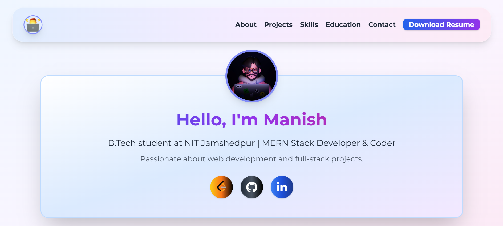

# 💼 Personal Portfolio Website

This is a **responsive and interactive portfolio website** built with **HTML, Tailwind CSS, and JavaScript** to showcase my skills, projects, education, and resume.



## 🌐 Live Demo

👉 [Click here to visit the live website](https://maniishh.github.io/PORTFOLIO/)

---

## 📁 Project Structure
```
portfolio/
├── assets/
│ ├── jnv.png
│ ├── logo.png
│ ├── nit.png
│ ├── postnet.png
│ ├── reserve.png
│ ├── resume.pdf
│ ├── sjp.png
│ └── trend.png
├── css/
│ └── [your-styles.css]
└── index.html

---

```
🛠️ Tech Stack
```
HTML5

Tailwind CSS

JavaScript
```
## ✨ Features

- 🌀 Animated gradient background with smooth transitions
- 📱 Responsive mobile menu toggle
- 🖼️ Project cards with images
- ⏳ Loading spinner on page load
- 📄 Resume download option (PDF)
- 🔗 Links to LinkedIn, GitHub, and social profiles
- 🔧 Clean file structure with organized assets and styles

---

## 🚀 Getting Started

### 📦 Clone this repo

```bash
git clone https://github.com/yourusername/portfolio.git
cd portfolio

